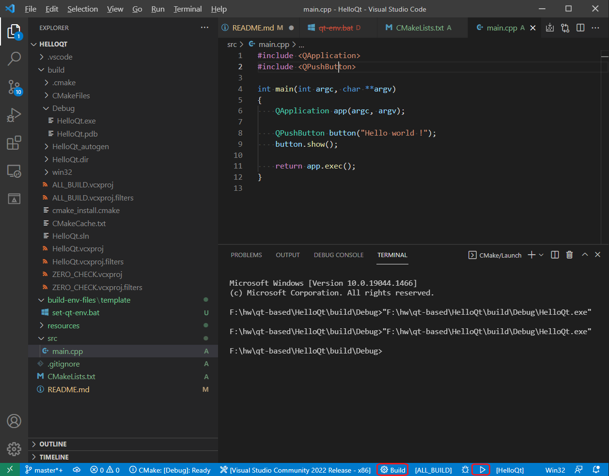

# Demonstrate how to set QT app project with the VSCode for Win32 platform.

The VSCode supports CMake for C++ source code build.  
But there is lack of information for setting to build Win32 QT app.  
This repository contains Win32 QT app and CMakefileLists.txt.

## Preinstallation
1. Visual Studio 2022
2. Visual Studio Code  
   with `C/C++`, `CMake` extensions installed.  
   Add Visual Studio Code exe file path to your %PATH%.
3. QT5  
    [https://www.qt.io/download-qt-installer](https://www.qt.io/download-qt-installer)

## Copy the template batch file and modify the file according to your env.
```
cd <this repository>
copy build-env-files\template\set-qt-env.bat build-env-files\my-qt-env.bat
notepad build-env-files\my-qt-env.bat
```

## Run code program in the cmd which it was set the build env variables.
```
build-env-files\my-qt-env.bat
code .
```

## Build project and `Run` program
 - Build by clicking the `build` button on vscode bottom status bar.
 - Run by clicking the `play` button on vscode bottom status bar.

 - Build output will be shown in `build` sub directory.
